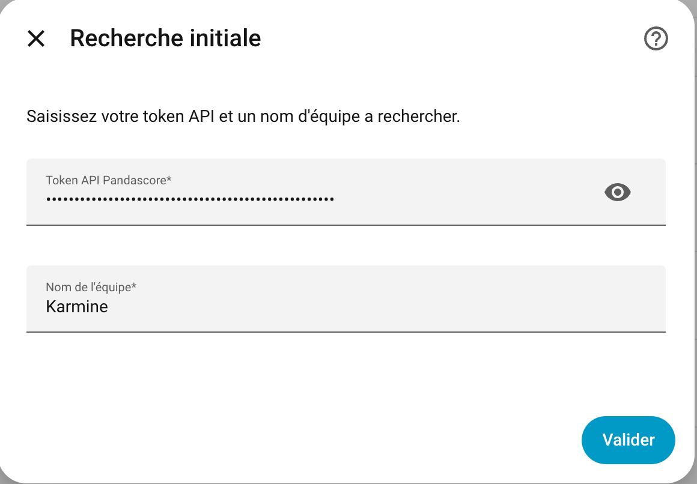
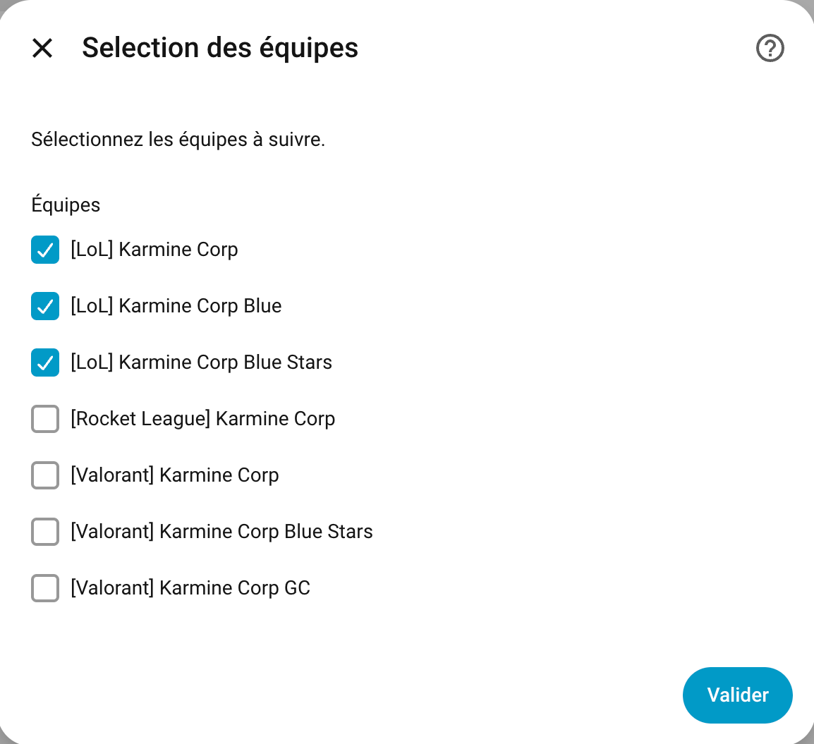

# 🕹️ Intégration PandaScore pour Home Assistant

[](https://my.home-assistant.io/redirect/hacs_repository/?owner=pa-martin&repository=ha-pandascore&category=integration)
[](https://www.home-assistant.io/blog/2026/07/01/release-20267/)

[](https://github.com/pa-martin/ha-pandascore/blob/main/LICENSE)
[](https://github.com/pa-martin/ha-pandascore/releases)
[](https://github.com/pa-martin/ha-pandascore/commits/main)
[](https://github.com/pa-martin/ha-pandascore/stargazers)


Suivez les matchs de vos équipes e-Sport préférées via l'API PandaScore et la carte personnalisée Team Tracker.

---

## 📦 Installation

### 1. Via HACS (recommandé)

> Nécessite HACS installé dans Home Assistant

1. Aller dans **HACS**
2. Chercher **PandaScore API**
3. Installer puis redémarrer Home Assistant

### 2. Manuel (sans HACS)

1. Télécharger le contenu du dépôt
2. Copier le dossier `pandascore` dans `config/custom_components/`
3. Redémarrer Home Assistant

---

## ⚙️ Configuration

1. Aller dans **Paramètres → Appareils & services → Ajouter une intégration**
2. Rechercher **PandaScore API**
3. Rechercher des équipes :
  - Clé API PandaScore
  - Mots clés permettant de rechercher plusieurs équipes (eg: karmine, gentle mates)
4. Choix des équipes :
  - Une liste d'équipe retournée par l'API est affichée
  - Sélectionner les équipes qui vous intéressent
  - Les équipes sont affichées avec le format `[Jeu-vidéo] Nom de l'équipe`

Plusieurs recherches peuvent être configurées séparément.

## 🔐 Clé API PandaScore

Obtenez votre clé ici : [https://app.pandascore.co/signup](https://app.pandascore.co/signup)

1. Créez un compte ou connectez-vous
2. Générez une clé API gratuite (Section "Your access token")
3. Utilisez-la lors des configurations (limite de 1 000 requêtes par heure)

---

## 📊 Capteurs créés
- `sensor.{videGame_slug}_{team_slug}` - Le prochain match de l'équipe si elle a un match à venir sinon le dernier
    - Compatible avec la carte TeamTracker
- `sensor.{videGame_slug}_{team_slug}_name` - Le nom de l'équipe
- `sensor.{videGame_slug}_{team_slug}_game` - Le jeu vidéo associé à l'équipe
- `sensor.{videGame_slug}_{team_slug}_next_match` - Le prochain match qui sera joué
  - Compatible avec la carte TeamTracker
- `sensor.{videGame_slug}_{team_slug}_last_match` - Le dernier match qui a été joué
  - Compatible avec la carte TeamTracker
- `sensor.{videGame_slug}_{team_slug}_matches_won` - Le nombre de matchs gagnés sur l'année en cours
- `sensor.{videGame_slug}_{team_slug}_matches_lost` - Le nombre de matchs perdus sur l'année en cours
- `sensor.{videGame_slug}_{team_slug}_win_rate` - Le taux de victoire de l'équipe sur l'année en cours
- `sensor.{videGame_slug}_{team_slug}_matches_played` - Le nombre de matchs joués sur l'année en cours
  - Matches - La liste des matchs joués
- `sensor.{videGame_slug}_{team_slug}_upcoming_matches` - Le nombre de matchs à venir
    - Matches - La liste des matchs à venir

### Attributs des capteurs de match

Ces attributs permettent d'utiliser la carte lovelace type: custom:teamtracker-card (voir plus bas)

Attributs relatifs au match
- `state` - L'état du match : PRE (à venir), IN (en cours), POST (terminé)
- `sport` - Le nom (court) de la league (à remplacer par le nom du jeu ?)
- `league_name` - Le nom complet de la ligue : `[Nom court] Tournois en court` (eg: `[LEC] Winter split`)
- `league_logo` - Le logo de la league
- `date` - La date de début du match
- `last_update` - La dernière actualisation du capteur
- `clock` - Date relative depuis le début du match (POST)
- `kickoff_in` - Date relative avant le début du match (1ère ligne à gauche - PRE)
- `odds` - Le nombre de matchs à gagner pour remporter la partie (1ère ligne à droite - PRE)
- `venue` - Le jeu-vidéo du match (2ème ligne à gauche - PRE)
- `overunder` - Le nom complet du match  (2ème ligne à droite - PRE)
- `location` - La version du jeu-vidéo (3ème ligne à gauche - PRE)
- `tv_network` - Le lien de diffusion du match  (3ème ligne à droite - PRE)

- `down_distance_text` - Le nom complet du match (è ligne à gauche - IN)
- `tv_network` - Le lien de diffusion du match  (è ligne à droite - IN)

Attributs dépendants du side (`team` et `opponent`)
- `_name` - Le nom de l'équipe
- `_logo` - Le logo de l'équipe (mode clair)
- `_logo_dark` - Le logo de l'équipe (mode sombre)
- `_score` - Le score du match en cours (IN) ou passé (POST)
- `_timeouts` - Le score du match en cours (IN)
- `_win_probability` - Non-implémenté (IN)
- `_colors` - La couleur à utiliser pour les timeouts (IN)
- `_homeaway` - Domicile ou extérieur
- `_winner` - Gagnant du match (POST)
- `_record` - Le score dans la ligue (X-Y)
- `_rank` - Non-implémenté

---

## 🎨 Carte Lovelace — Team Tracker Card

L'intégration est concue de manière à être compatible avec la carte lovelace [ha-teamtracker-card](https://github.com/vasqued2/ha-teamtracker-card).
Les sensors suivant peuvent être utilisés avec la card :
- `sensor.{videGame_slug}_{team_slug}`
- `sensor.{videGame_slug}_{team_slug}_next_match`
- `sensor.{videGame_slug}_{team_slug}_last_match`

### Ajouter la carte

Dans un tableau de bord, cliquer sur **+ Ajouter une carte** → chercher **Team Tracker Card**.

La configuration peut ensuite se faire :

- via l'éditeur visuel Lovelace (nécessite une adaptation externe)
- ou via YAML

Ou en YAML :

```yaml
type: custom:teamtracker-card
entity: sensor.lol_karmine_corp_last_match
```

```yaml
type: custom:teamtracker-card
entity: sensor.lol_karmine_corp
home_side: left
show_timeouts: true
show_rank: true
show_league: true
outline: true
debug: true
```

---

## 📸 Aperçus

**Première étape :**



**Seconde étape :**



---

## 🛠 Développement

Compatible avec Home Assistant `2026.7+`.
Voir la [documentation](./docs/development.md) de développement local.

Structure :
- `translations/*.json` : fichiers de traduction des capteurs
- `__init__.py` : enregistrement de l'intégration et de la carte Lovelace
- `api.py` : intégration de l'API
- `config_flow.py` : assistant UI de configuration
- `const.py` : constantes
- `coordinator.py` : logique de récupération intelligente
- `manifest.json` : métadonnées et dépendances
- `models.py` : modèles de données
- `sensor.py` : entités de capteurs
- `strings.json` : chaînes de caractères traduites
- `utils.py` : fonctions utilitaires

---

## 👨‍💻 Auteur

Développé par [pa-martin](https://github.com/pa-martin)
Contributions bienvenues via **Pull Request** ou **Issues**

---

## 📄 Licence

Code open-source sous licence **MIT**
